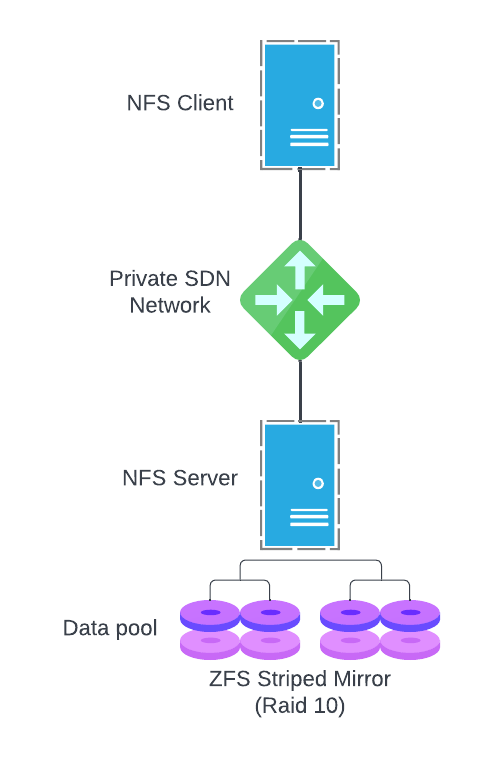

# simple-nas-nfs
This is simple example of how to create NFS Network Area Storage with UpCloud Terraform provider. In this example we create server that acts
as nfs client and the NFS server.



### Prerequisites

Project uses [Terraform](https://www.terraform.io/) and should be installed. We're also using UpCloud's Terraform provider, but it should be automatically installed by running `terraform init`.

To create the resources with Terraform, you'll need your API credentials exported.

```
export UPCLOUD_USERNAME=your_username
export UPCLOUD_PASSWORD=your_password
```

You must also create `config.tfvars` file with your own settings:
 
```
zone = "pl-waw1"
client_plan = "4xCPU-8GB"
nas_plan = "4xCPU-8GB"
storage_size = 100
nas_network    = "10.20.0.0/24"
ssh_key_public = "ssh-rsa AAAA_YOUR_SSH_PUBLIC_KEY"
```

### Quickstart

**IMPORTANT: Make sure your SSH-agent is running (execute this if not: `eval$(ssh-agent) && ssh-add <path_to_private_key> && ssh-add -L`), so Ansible and Terraform scripts can SSH into VMs using agent forwarding**

### Creating services with basic configuration

Initiate the project and install providers.

```
make init
```

Demo can now be created with Terraform. Creation takes around 10 minutes.

```
make create
```

### Deleting the demo

After testing things around its good to free the resources. Tearing the thing down is also just one command.

```
make destroy
```